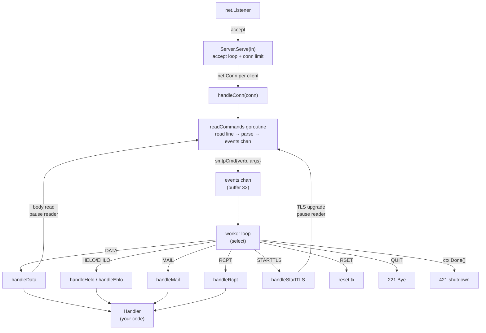

# smtp-gateway

SMTP gateway library for Go. Accept inbound email and route it anywhere.

The server calls your handler at each SMTP transaction phase — HELO, MAIL
FROM, RCPT TO, DATA — so you can accept, reject, or redirect messages to S3,
Kafka, the local filesystem, `/dev/null`, or anywhere else.

## Architecture



**Data flow:** A reader goroutine scans SMTP commands into a buffered channel
(32 deep) while the worker processes them sequentially. This enables RFC 2920
PIPELINING — clients can send multiple commands without waiting for responses.
Internally, the reader pauses during DATA (so the worker can read the body
directly) and during STARTTLS (so the TLS handshake has exclusive access to
the connection). STARTTLS itself is driven by `Server.TLSConfig` — just set
it and the server handles the upgrade.

**Concurrency:** Each connection gets one goroutine. A semaphore caps
concurrent connections. Per-phase callbacks are serialized per connection
but the same Handler instance handles all connections concurrently.

### Customising behaviour

| What you want | How to do it |
|---|---|
| Reject at HELO (auth, blocklist) | Return non-250 from `Handler.Hello` |
| Reject sender | Return non-250 from `Handler.MailFrom` |
| Accept/reject individual recipients | Return 250/non-250 from `Handler.RcptTo` |
| Store/reject message body | `Handler.Data` gets the raw RFC 5322 bytes |
| Enable STARTTLS | Set `Server.TLSConfig` |
| Enable SMTPS (implicit TLS on connect) | Pass a `tls.Listener` to `Serve` |
| Limit message size | Set `Server.MaxMessageSize` |
| Limit recipients per message | Set `Server.MaxRecipients` |
| Limit concurrent connections | Set `Server.MaxConnections` |
| Quiet operation | Set `Server.Logger = nil` |
| Structured JSON logging | `Server.Logger = smtpgateway.Slog(slog.New(slog.NewJSONHandler(...)))` |
| Capture raw mail to disk | Set `Server.PostcatDir` |
| Disable PIPELINING | Not yet configurable (always on) |

## Features

- **PIPELINING** — full RFC 2920 support with backpressure
- **STARTTLS** — bring your own `tls.Config`; also supports SMTPS via `tls.Listener`
- **Per-phase hooks** — inspect and reject at HELO, MAIL FROM, RCPT TO, DATA
- **Partial failure** — accept some recipients, reject others
- **Raw body** — receive the complete RFC 5322 message (headers + body) at DATA
- **Configurable responses** — set exact SMTP status codes from your handler
- **Graceful shutdown** — drain active connections
- **Postcat sink** — optional flat-file output in Postfix-compatible format;
  capture messages during setup before you wire up a real backend
- **Minimal dependencies** — standard library only
- **Concurrency** — one goroutine per connection with configurable limits

## Install

```
go get github.com/stupoid/smtp-gateway
```

## Quick start

```go
package main

import (
    "context"
    "log/slog"
    "net"
    "os"
    "strings"
    "time"

    "github.com/stupoid/smtp-gateway"
)

type myHandler struct{}

func (h *myHandler) Hello(ctx context.Context, tx *smtpgateway.Tx) *smtpgateway.Response {
    slog.Info("hello", "domain", tx.Helo)
    return smtpgateway.RespHelloOK
}

func (h *myHandler) MailFrom(ctx context.Context, tx *smtpgateway.Tx) *smtpgateway.Response {
    if tx.MailFrom == "spam@evil.com" {
        return &smtpgateway.Response{550, "5.7.1 Go away"}
    }
    return smtpgateway.RespMailOK
}

func (h *myHandler) RcptTo(ctx context.Context, tx *smtpgateway.Tx) *smtpgateway.Response {
    last := tx.Rcpts[len(tx.Rcpts)-1]
    if !strings.Contains(last, "@mydomain.com") {
        return &smtpgateway.Response{550, "5.1.1 Relaying denied"}
    }
    return smtpgateway.RespRcptOK
}

func (h *myHandler) Data(ctx context.Context, tx *smtpgateway.Tx, body []byte) *smtpgateway.Response {
    slog.Info("got message",
        "from", tx.MailFrom,
        "recipients", tx.Accepted,
        "bytes", len(body),
    )
    // Write to S3, Kafka, or wherever.
    return smtpgateway.RespDataOK
}

func main() {
    srv := smtpgateway.Server{
        Hostname:       "mx.example.com",
        Handler:        &myHandler{},
        MaxMessageSize: 10 << 20, // 10 MiB
        MaxConnections: 100,
        ReadTimeout:    5 * time.Minute,
        WriteTimeout:   1 * time.Minute,
        IdleTimeout:    5 * time.Minute,
        Logger:         smtpgateway.Slog(slog.Default()),
        PostcatDir:     "/var/spool/mail/incoming",
    }

    ln, err := net.Listen("tcp", ":25")
    if err != nil {
        slog.Error("listen", "error", err)
        os.Exit(1)
    }
    defer ln.Close()

    slog.Info("listening", "addr", ln.Addr())
    if err := srv.Serve(ln); err != nil {
        slog.Error("serve", "error", err)
    }
}
```

## With STARTTLS

```go
cert, _ := tls.LoadX509KeyPair("cert.pem", "key.pem")

srv := smtpgateway.Server{
    Hostname:  "mx.example.com",
    Handler:   handler,
    TLSConfig: &tls.Config{
        Certificates: []tls.Certificate{cert},
    },
}

ln, _ := net.Listen("tcp", ":587")
srv.Serve(ln)
```

For implicit TLS (SMTPS, port 465), wrap the listener yourself:

```go
ln, _ := net.Listen("tcp", ":465")
tlsLn := tls.NewListener(ln, tlsConfig)
srv.Serve(tlsLn)
```

## Postcat sink

The `PostcatDir` option writes each accepted message as a flat file in
[Postfix `postcat(1)`](https://www.postfix.org/postcat.1.html) format.
It's a convenience sink — use it when you're setting up the gateway and
haven't decided on a final storage backend yet. Every file captures the
full envelope (sender, recipients, timestamp) and raw message body, so you
can replay or migrate them later without losing any data.

```go
srv := smtpgateway.Server{
    PostcatDir: "/var/spool/mail/incoming",
    // ... other fields
}
```

### CLI reader

A standalone `postcat` command reads individual files for testing and
inspection:

```
$ go build -o postcat ./cmd/postcat/
$ ./postcat $HOME/mail/incoming/1718832000-12345.eml
Sender:     sender@example.com
Recipients: [rcpt1@example.com rcpt2@example.com]
Time:       2024-06-20 09:30:00
Body size:  1024 bytes

--- Raw message ---
Subject: Test
...
```

### Programmatic access

The `internal/postcat` package provides a programmatic API for reading and
writing postcat files.  Note that Go's `internal` convention restricts this
import to code within the `smtp-gateway` module — it is not available to
external consumers.

```go
import "github.com/stupoid/smtp-gateway/internal/postcat"

msg, err := postcat.Parse("/path/to/file.eml")
fmt.Println("from:", msg.Sender)
fmt.Println("to:",   msg.Recipients)
fmt.Println("raw:",  string(msg.RawMessage))
```

See `cmd/verify-postcat/` for a batch verification tool that scans
directories.

### Replay into an SMTP server

`postcat-replay` replays captured postcat files through any SMTP server
— useful for migration, testing, or debugging:

```
$ go build -o postcat-replay ./cmd/postcat-replay/
$ ./postcat-replay -addr :2525 /var/spool/mail/incoming/*.eml
OK   /var/spool/mail/incoming/file1.eml
OK   /var/spool/mail/incoming/file2.eml
FAIL /var/spool/mail/incoming/bad.eml: no recipients in postcat file
```

It opens a fresh connection per file and replays the full SMTP
transaction (EHLO → MAIL FROM → RCPT TO → DATA → QUIT).  Null senders
(`<>`) are handled correctly.  Batch-replay multiple files by passing
them as positional arguments — exits non-zero if any file fails.

Flags:
- `-addr` — SMTP server address (default `:2525`)

## Handler contract

- **Hello** — called after HELO/EHLO. Reject to close the connection.
- **MailFrom** — called after MAIL FROM. `tx.MailFrom` and `tx.Params` are populated.
- **RcptTo** — called for each RCPT TO. Accept/reject individually.
  `tx.Rcpts` has all presented; `tx.Accepted` has the accepted subset.
- **Data** — called with the raw RFC 5322 message. Also called for
  BDAT/CHUNKING (RFC 3030) transactions where chunks are accumulated in
  `tx.BodyBuf` and passed as `body`. Only called if ≥1 recipient was
  accepted. Return non-250 to bounce.

Callbacks are **serialized per connection**. The same handler instance
handles multiple connections concurrently — make it goroutine-safe if it
needs mutable state.

### Common pitfalls

- **Handler must be goroutine-safe.** One `Handler` instance handles all
  connections. Avoid unsynchronized mutable fields — use `sync.Mutex`
  or channels.

- **nil → 503.** Returning `nil` from any callback causes the server to
  respond `503 Bad sequence`. If you want to accept, return the
  appropriate `Resp*` constant.

- **STARTTLS needs TLSConfig set before Serve.** The EHLO banner is
  built once per connection, not lazily. Set `Server.TLSConfig` before
  calling `Serve`.

- **Body vs BodyBuf.** For DATA transactions, the body is passed directly
  to `Handler.Data`. For BDAT/CHUNKING, chunks accumulate in `tx.BodyBuf`
  and are passed as `body` on the LAST chunk. In both cases your `Data`
  handler receives the complete message.

## Protocol support

| Feature | Status |
|---------|--------|
| EHLO / HELO | ✅ |
| PIPELINING (RFC 2920) | ✅ |
| STARTTLS (RFC 3207) | ✅ |
| SMTPS (implicit TLS, port 465) | ✅ via `tls.Listener` |
| 8BITMIME | ✅ with enforcement (rejects 8-bit data without BODY=8BITMIME) |
| ENHANCEDSTATUSCODES | ✅ |
| SMTPUTF8 | ✅ |
| SIZE | ✅ (when `MaxMessageSize > 0`) |
| Graceful shutdown | ✅ |
| CHUNKING / BDAT (RFC 3030) | ✅ |

### SMTP AUTH — out of scope

SMTP authentication (RFC 4954, SASL) is a submission protocol — it lets a
user prove they're allowed to relay mail through a server.  This library is
an **inbound gateway**: it receives mail from the internet on port 25 and
routes it to storage.  MX delivery is unauthenticated by design.

For access control at the gateway layer, use the Handler callbacks you
already have — check `tx.RemoteAddr` in `Hello`, inspect `tx.MailFrom`,
or run reverse-DNS on the connecting IP.  Mutual TLS (`tls.Config.ClientAuth`)
also works without SASL machinery.

If you need a full SMTP submission server with AUTH for your users to send
outbound mail (port 587), consider:

- **[mox](https://github.com/mjl-/mox)** — full mail server in Go, includes submission
- **[go-smtp](https://github.com/emersion/go-smtp)** — SMTP client/server library with SASL support

## Logging

The server emits structured log events through the `Logger` interface.
Pass `smtpgateway.Slog(slog.Default())` for standard output, `nil` to
discard, or implement your own adapter.

### Interface

```go
type Logger interface {
    Debug(msg string, args ...any)
    Info(msg string, args ...any)
    Error(msg string, args ...any)
}
```

The `args` variadic follows `slog` conventions — pass key=value pairs
using `slog.String`, `slog.Int`, `slog.Duration`, etc.  The built-in
`SlogAdapter` passes them straight through to the underlying `*slog.Logger`.

### Built-in adapter

`smtpgateway.Slog(l)` wraps a `*slog.Logger`:
- `Debug` → `slog.LevelDebug`
- `Info` → `slog.LevelInfo`
- `Error` → `slog.LevelError`

Control output format and level via the standard `slog` handler:

```go
// JSON to stderr with debug logging
srv.Logger = smtpgateway.Slog(slog.New(slog.NewJSONHandler(os.Stderr, &slog.HandlerOptions{
    Level: slog.LevelDebug,
})))

// Text to a file
f, _ := os.OpenFile("/var/log/smtp-gateway.log", os.O_APPEND|os.O_CREATE|os.O_WRONLY, 0644)
srv.Logger = smtpgateway.Slog(slog.New(slog.NewTextHandler(f, nil)))
```

### Custom logger

Implement the three-method `Logger` interface to send events to any sink:

```go
type syslogLogger struct{}

func (s *syslogLogger) Debug(msg string, args ...any) {}
func (s *syslogLogger) Info(msg string, args ...any)  {}
func (s *syslogLogger) Error(msg string, args ...any) {}

srv.Logger = &syslogLogger{}
```

### Events

| Event | Level | Attrs |
|-------|-------|-------|
| `connection_opened` | Debug | `remote` |
| `connection_closed` | Debug | `remote` |
| `smtp_recv` | Info | `verb`, `args` (truncated) |
| `data_received` | Info | `bytes`, `mail_from`, `recipients` |
| `bdat_received` | Info | `bytes`, `mail_from`, `recipients` |
| `read_error` | Error | `error` |
| `data_read_error` | Error | `error` |
| `tls_handshake_error` | Error | `error` |
| `max_connections_reached` | Error | — |
| `postcat_write_error` | Error | `error`, `path` |
| `max_message_size` | Info | `bytes` (at startup) |

Every event is a single line; fields are `key=value` pairs.  Pipe
through `jq` for filtering when using JSON output.

## License

MIT
